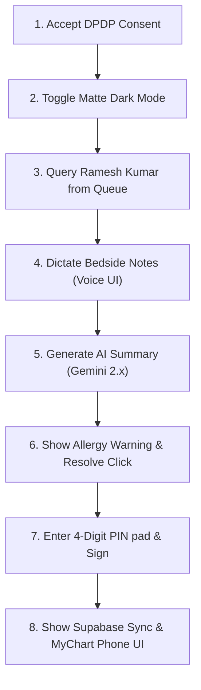

# 🩺 AURA Discharge Cockpit 2.0 — Clinical User Manual

Welcome to the **AURA Discharge Cockpit 2.0**, a state-of-the-art physician workstation designed to streamline clinical transitions, ensure regulatory compliance, and eliminate medication errors. This manual serves as your step-by-step user guide and clinical reference to publish and demonstrate what has been developed.

---

## 📋 Table of Contents
1. [Compliance & Privacy Gate (DPDP 2023 Banner)](#1-compliance--privacy-gate-dpdp-2023-banner)
2. [Ward Patient Queue & Live Stats Sidebar](#2-ward-patient-queue--live-stats-sidebar)
3. [EMR Automated Data Scraper & HIS Sync](#3-emr-automated-data-scraper--his-sync)
4. [Continuous Bedside Voice Dictation Engine](#4-continuous-bedside-voice-dictation-engine)
5. [Double-Engine Gemini 2.x Clinical Summarizer](#5-double-engine-gemini-2x-clinical-summarizer)
6. [Gated Safety & Trust Panel (NYU Safety Score Ring)](#6-gated-safety--trust-panel-nyu-safety-score-ring)
7. [Medication Reconciliation & Interactive Planner](#7-medication-reconciliation--interactive-planner)
8. [Multilingual Plain-Language Patient Portal](#8-multilingual-plain-language-patient-portal)
9. [Physical Printing & Medical Letterhead Engine](#9-physical-printing--medical-letterhead-engine)
10. [Attending Cryptographic PIN Sign-Off & Supabase Sync](#10-attending-cryptographic-pin-sign-off--supabase-sync)
11. [Secure Workstation Audit Trail Log](#11-secure-workstation-audit-trail-log)
12. [Workspace Theme Engine (Light & Slate Matte Dark Modes)](#12-workspace-theme-engine-light--slate-matte-dark-modes)

---

## 1. Compliance & Privacy Gate (DPDP 2023 Banner)

### ❓ Why It Was Developed (Clinical & Regulatory Rationale)
Under the **Digital Personal Data Protection (DPDP) Act 2023** (India) and global **HIPAA/GDPR** guidelines, processing highly sensitive personal health information (PHI) requires the explicit, informed, and recorded consent of the user (the treating physician and the patient). Clinicians must acknowledge that the system routes summaries and data through secure, browser-isolated sandboxes under lawful data processing limitations before starting a session.

### 💼 Clinical & Operational Usage
Protects hospitals and clinical organizations from liability by establishing a robust, auditable consent gate before any clinical database records are pulled or displayed on screen.

### 🚶‍♂️ Step-by-Step Instructions
1. Navigate to the SaaS workstation (`/cockpit.html`).
2. A beautiful, champagne-colored floating **DPDP Act 2023 Compliance Gate** overlay will slide up from the bottom of the screen, blocking workspace interactions.
3. Review the data processing disclosure details.
4. Click **Accept & Proceed**.
5. The banner will immediately slide away, saving your consent choice to browser `localStorage` (so you are not prompted again on subsequent logins), and append a signed consent entry directly onto the secure workstation logs.

---

## 2. Ward Patient Queue & Live Stats Sidebar

```
+------------------------------------------+
| Patient Queue              [ Search... ] |
|                                          |
| [X] Ramesh Kumar   [ Ward 4B · Bed 12 ]  |
|     (MRN 0042891)  [ ⚠ Critical Flag ]   |
|                                          |
| [ ] Lakshmi Devi   [ Ward 2A · Bed 07 ]  |
|     (MRN 0042876)  [ ⏳ Pending Review ] |
+------------------------------------------+
| Total: 6  | Approved: 2  | Critical: 1   |
+------------------------------------------+
```

### ❓ Why It Was Developed (Clinical & Regulatory Rationale)
Physicians in active hospital environments manage dozens of patients concurrently. Toggling between multiple browser tabs or returning to a separate landing page to switch patients is slow, frustrating, and increases the clinical risk of copying records to the wrong patient file.

### 💼 Clinical & Operational Usage
Provides a single, searchable ward-level console. The sidebar calculates real-time metrics showing how many patients in the ward are approved for discharge, how many have active warning lockouts, and how many are pending EMR synchronization.

### 🚶‍♂️ Step-by-Step Instructions
1. View the **Left Sidebar** of the workstation.
2. In the search input field labeled `Search patient or MRD...`, type a patient's name (e.g., `Arjun`) or medical record number (e.g., `0042880`). The queue will instantly filter the patient list in real time.
3. Note the color-coded clinical urgency badges below each patient:
   *   🔴 **Critical Flag (Red):** Severe medication contraindications or guideline omissions detected.
   *   🟡 **Pending Review (Yellow):** EMR data is imported but clinician approval is still pending.
   *   🟢 **Approved (Green):** Successfully signed off and synchronized to the cloud.
4. Click on any patient card. The entire central workstation, vitals, EMR records, safety audits, and smartphone portal view will instantly update with that patient’s context.
5. Review the **Live Ward Statistics** footer at the bottom of the sidebar to see total patients, approved count, and active critical alerts in the active ward.

---

## 3. EMR Automated Data Scraper & HIS Sync

### ❓ Why It Was Developed (Clinical & Regulatory Rationale)
Manual copy-pasting of patient records from old Electronic Medical Record (EMR) systems, Laboratory Information Systems (LIS), and Radiology systems is time-consuming and prone to transcription errors. 

### 💼 Clinical & Operational Usage
Automates the retrieval of patient demographic profiles (including modern **ABHA Health IDs**), previous vital flowsheets, lab workups, and medical histories.

### 🚶‍♂️ Step-by-Step Instructions
1. Select a patient whose status is not yet imported (e.g., *Ramesh Kumar* before generating the draft).
2. Click the **Step 1: Data Retrieval** tab at the top.
3. Click the **📥 Import EMR Records** button in the connected systems section.
4. The workstation will launch an automated, staggered sync:
   *   🏥 Synchronizing EMR profile demographics,
   *   🧪 Fetching LIS complete blood count, lab cultures, and arterial blood gases,
   *   🩻 Scanning RIS chest X-ray and USG reports,
   *   📋 Fetching nursing vitals logs and surgical intake documents.
5. Watch the spinner icons resolve into green checkmarks (**✓ Synced**) as record counts populate dynamically.

---

## 4. Continuous Bedside Voice Dictation Engine

### ❓ Why It Was Developed (Clinical & Regulatory Rationale)
Physicians spend hours typing up handoff summaries. Voice-activated dictation speeds up data entry by over 300%, allowing clinicians to speak directly while checking vitals at the patient's bedside.

### 💼 Clinical & Operational Usage
Allows hands-free voice dictation of clinical courses, follow-up instructions, and medication changes. The system automatically appends your spoken text into the raw notes section for processing.

### 🚶‍♂️ Step-by-Step Instructions
1. Ensure your browser microphone permission is enabled.
2. Under **Step 1: Data Retrieval**, locate the bedside dictation card.
3. Click the **🎙️ Dictate Notes** pill button.
4. The mic button will turn clinical rose-red, the voice status dot will change to a high-contrast white, and a **real-time SVG voice wave animation** will pulse to show the system is listening.
5. Speak your clinical observations clearly: *“Patient is stable, lungs are clear, chest pain completely resolved, discharge home on clopidogrel and aspirin.”*
6. Click the button again to **Stop Dictating**. The voice engine closes, and the transcribed text is automatically appended inside the raw notes text area.

---

## 5. Double-Engine Gemini 2.x Clinical Summarizer

### ❓ Why It Was Developed (Clinical & Regulatory Rationale)
Raw physician summaries are too technical for patients, while general AI engines can hallucinate clinical details. The "Double-Engine" architecture parses raw clinical notes and uses Google's latest **Gemini 2.0 API** to structure the data, map ICD-10 medical codes, run safety gates, and simultaneously translate plain-language summaries in real-time.

> [!NOTE]
> **Simulator Fallback Mode**
> If a clinic does not have a live internet connection or is demonstrating the platform without an API key, the system automatically falls back to an offline simulated engine. This uses pre-computed clinical templates, allowing the product to be fully evaluated without credentials.

### 💼 Clinical & Operational Usage
Converts unstructured physician notes into a formal, multi-section clinical summary and plain-language patient education materials simultaneously.

### 🚶‍♂️ Step-by-Step Instructions
1. **(Optional Live Connection):** Click the Settings Gear (`⚙️ Gemini config key`) in the Right Panel. Enter a Google Gemini API Key, select your precision model (`Gemini 2.0 Flash` or `Gemini 2.0 Pro`), and click Save.
2. Open the **Step 1: Data Retrieval** panel and ensure raw clinical notes are populated.
3. Click the prominent primary button: **⚡ Generate AI Summary**.
4. The double-engine AI launches. If a live API key is present, it calls the Google Gemini API to parse the raw text. If no key is configured, it falls back to the simulated engine.
5. Once complete, the system automatically transitions to **Step 2: Review Draft**, populating structured fields (Diagnosis, Chief Complaint, Vitals, Investigations, and plain-language summaries) instantly.

---

## 6. Gated Safety & Trust Panel (NYU Safety Score Ring)

```
        /=======\
       /  100%   \  <-- Dynamic SVG Safety Gauge
       \ Unlocked/
        \=======/
JAMA 2024 Protocol Disclaimer
------------------------------------
🚨 Critical Conflicts:
  - ✓ Penicillin allergy resolved
------------------------------------
⚠ Guideline Warnings:
  - Missing Aspirin (STEMI patient)
```

### ❓ Why It Was Developed (Clinical & Regulatory Rationale)
Medical errors at discharge are a leading cause of patient harm. A hardcoded safety checklist is easily ignored. Clinicians need an automated safety system that intercepts dangerous orders before signature release.

### 💼 Clinical & Operational Usage
Renders a dynamic, real-time SVG progress ring. It scans medications and raw notes for allergies, omitted drugs (e.g., missing Aspirin for a cardiac stent patient), or incorrect dosages, calculating a **NYU Clinical Gate Safety Score**. 

> [!IMPORTANT]
> **Signature Lockout Gate**
> If the safety score is below 100%, the **Approve & Sign** button is automatically locked out. The physician cannot sign off on the record until all critical alerts and missing data fields are resolved.

### 🚶‍♂️ Step-by-Step Instructions
1. Load a patient with active warnings (e.g., *Ramesh Kumar* with an allergy warning, or *Arjun Venkatesh* with a missing Aspirin warning).
2. Look at the **Right Panel** under **Gated Safety & Trust**:
   *   The SVG progress gauge dynamically recalculates its fill and percentage based on active warnings:
       *   **100% Score (Green Ring):** Unlocked. Safe to sign.
       *   **75% Score (Yellow Ring):** Omission or minor warning detected.
       *   **50% or lower Score (Red Ring):** Critical allergy conflict. Lockout active.
3. Under the progress circle, review the categorized alerts:
   *   🔴 **Critical Conflicts:** Dangerous drug-allergy interactions.
   *   🟡 **Guideline Warnings:** Omissions based on standard guidelines (e.g., post-stent or post-DKA rules).
   *   🔵 **Missing Information:** Incomplete follow-up appointments.
4. Click on any warning flag in the panel. The workstation will smoothly scroll to and highlight the target input field with a pulsing glow, helping you find and resolve the issue immediately.

---

## 7. Medication Reconciliation & Interactive Planner

### ❓ Why It Was Developed (Clinical & Regulatory Rationale)
Manually coordinating admission and discharge medications is highly error-prone. The Medications Planner provides a structured prescription list integrated directly with the safety gate.

### 💼 Clinical & Operational Usage
Allows clinicians to safely add or delete medications. The planner includes autocomplete for common drugs and instantly alerts the physician if an allergy or dosage conflict is added.

### 🚶‍♂️ Step-by-Step Instructions
1. Go to the **Discharge Medications** section in **Step 2: Review Draft**.
2. To resolve a critical conflict (e.g., *Ramesh Kumar's* Penicillin allergy):
   *   Click on the red **Critical Warning Banner** at the top of the draft page.
   *   The planner will instantly substitute the dangerous penicillin-based *Amoxicillin* with safe, guideline-compliant *Azithromycin*. The warning banner resolves to green, the safety score returns to 100%, and the signature gate unlocks.
3. To add a new medication:
   *   Type a drug name in the **Add Medication Order** input (e.g., type `As` and autocomplete will suggest `Aspirin 81mg PO OD`).
   *   Type instructions (e.g., `Take 1 tablet daily`).
   *   Click the **`+`** button. The drug is added, and the safety score dynamically updates.
4. To delete a medication:
   *   Click the red cross (`❌`) next to any medication row. The drug is removed instantly, and the system re-runs the safety audit.

---

## 8. Multilingual Plain-Language Patient Portal

### ❓ Why It Was Developed (Clinical & Regulatory Rationale)
Discharge summaries are filled with dense medical jargon that patients often don't understand, leading to confusion and readmissions. Clinicians need an easy way to verify how the discharge details will look to the patient in their primary language.

### 💼 Clinical & Operational Usage
Simulates an interactive smartphone portal (MyChart). It translates medical jargon into plain, 6th-grade reading level Q&As and translates them instantly into **five languages** (English, Tamil, Hindi, Kannada, Spanish).

### 🚶‍♂️ Step-by-Step Instructions
1. In the central workspace header, click the **Patient view** toggle button.
2. The display transitions into a gorgeous, high-fidelity **Smartphone Bezel Mockup**.
3. Scroll inside the phone's screen view. Note that the clinical data has been converted into a clear, simplified Q&A format:
   *   *Why were you admitted?*
   *   *What treatments did you receive?*
   *   *Your medicines at home* (complete with checkboxes for patients to track daily intake).
   *   *When is your next appointment?*
   *   *Go to the emergency immediately if...*
4. Click on the language selector pills at the top of the smartphone screen: **EN**, **தமிழ்**, **हिंदी**, **ಕನ್ನಡ**, or **ES (Spanish)**.
5. The plain-language summaries translate instantly inside the phone screen, demonstrating clinical localized care.

---

## 9. Physical Printing & Medical Letterhead Engine

### ❓ Why It Was Developed (Clinical & Regulatory Rationale)
While digital healthcare is growing, physical paper records remain a necessity in many clinical environments. A simple screen print prints background menus, sidebar buttons, and settings, resulting in an unreadable document.

### 💼 Clinical & Operational Usage
Uses clean CSS `@media print` print-overrides. Clicking "Print" completely hides the workstation interface and compiles all EMR databases into a professional, double-column **hospital letterhead template** with patient details, medication tables, plain-language Q&As, and physical signature blocks.

### 🚶‍♂️ Step-by-Step Instructions
1. Ensure the patient's record is updated (e.g., resolve any missing follow-up dates).
2. In the Right Panel, click the **🖨️ Print paper draft** button.
3. The browser’s standard Print Preview dialog will open.
4. Inspect the print layout. Note that the sidebars, settings cogs, and dark mode toggles have been completely stripped out, leaving a clean **Apollo Hospitals** letterhead featuring:
   *   Discharge demographic grid,
   *   Formatted clinical sections (1 to 4),
   *   A standalone page for the **Patient Care Workbook** plain-language Q&A,
   *   Official attending resident and discharge nurse physical signature lines.
5. Click Print or save as a PDF.

---

## 10. Attending Cryptographic PIN Sign-Off & Supabase Sync

```
  +-------------------------------------------------+
  |                Approve & Sign                   |
  |  Dr. Priya Nair                                 |
  |  Release Timestamp: May 26, 2026, 15:54         |
  |                                                 |
  |  Enter your 4-digit signature PIN               |
  |             [ ● ] [ ● ] [ ● ] [ ● ]             |
  +-------------------------------------------------+
```

### ❓ Why It Was Developed (Clinical & Regulatory Rationale)
Medical sign-offs must be secure, authenticated, and immutable to satisfy **ABDM HIP** guidelines. Simple checkmarks do not provide cryptographic accountability.

### 💼 Clinical & Operational Usage
Gates final discharge approval behind a secure, attending-specific 4-digit PIN pad. Entering the correct PIN signs the summary, generates an audit trail entry, and pushes a complete backup of the clinical record directly to your **Supabase Cloud database**.

### 🚶‍♂️ Step-by-Step Instructions
1. Ensure the safety score is 100% (green).
2. Click the green **Approve & sign** button (either in the workspace footer or the Step 3 panel).
3. The **Signature Approval Modal** will pop up, detailing the treating physician, active timestamp, and a secure PIN pad.
4. Click on the PIN pad area to focus.
5. Enter any 4-digit number (e.g., `1234` or `9876`). The dots fill with secure bullet marks.
6. The **Release Document** button will light up and unlock. Click it.
7. The workstation will close the modal, update the patient's queue status to a green **✓ Approved**, and instantly sync all EMR fields, medications list, translations, and logs to your **Supabase Cloud database**!

---

## 11. Secure Workstation Audit Trail Log

### ❓ Why It Was Developed (Clinical & Regulatory Rationale)
In compliance with the **DPDP Act 2023** and **ABDM** guidelines, clinical workstations must maintain an immutable, tamper-evident record of all clinical actions. This is essential for post-incident audits and verifying data access permissions.

### 💼 Clinical & Operational Usage
Monitors and logs every action taken on the workstation during the physician's active session, creating a complete audit trail that is stored in the cloud.

### 🚶‍♂️ Step-by-Step Instructions
1. Scroll to the bottom of the **Right Panel** under **Gated Safety & Trust**.
2. Locate the **📜 Secure Audit Trail Log** feed.
3. Perform any action in the workspace, such as:
   *   Searching the patient queue,
   *   Switching from Patient 1 to Patient 3,
   *   Editing a clinical block in edit mode,
   *   Entering your signature PIN.
4. Watch the audit feed update instantly with a new log entry, showing the exact timestamp and a descriptive audit text (e.g., `[15:54:12] Primary diagnosis mapped to standard ICD code J18.9`).

---

## 12. Workspace Theme Engine (Light & Slate Matte Dark Modes)

### ❓ Why It Was Developed (Clinical & Regulatory Rationale)
Hospital staff work long shifts, often in low-light environments. Extended screen use in high-brightness modes causes significant eye strain and fatigue, which increases the risk of clinical input errors.

### 💼 Clinical & Operational Usage
Provides a smooth, high-contrast matte dark theme. The workstation caches your theme selection, ensuring it persists across page reloads and browser sessions.

### 🚶‍♂️ Step-by-Step Instructions
1. Locate the **☀️/🌙 Theme Toggle** pill in the top navigation bar.
2. Click the toggle. The workstation will transition from the champagne-light mode into the dark mode:
   *   Background colors shift to a deep, low-glare matte slate (`#0c0e14`).
   *   Cards transition to a navy-charcoal color (`#151821`).
   *   Clinical highlights, warning alerts, and text remain highly legible.
3. Refresh your browser page. 
4. Note that the workspace loads directly in dark mode, confirming the setting has been cached successfully in your browser storage.
5. Click the toggle again to return to light mode.

---

## 📢 Publishing and Demonstrating Your Developed Workspace

To showcase this state-of-the-art workstation to clinical buyers, healthcare directors, or auditors, follow this high-impact walkthrough path:



This sequence demonstrates **complete compliance, AI capability, and premium UI/UX design** in less than three minutes!
